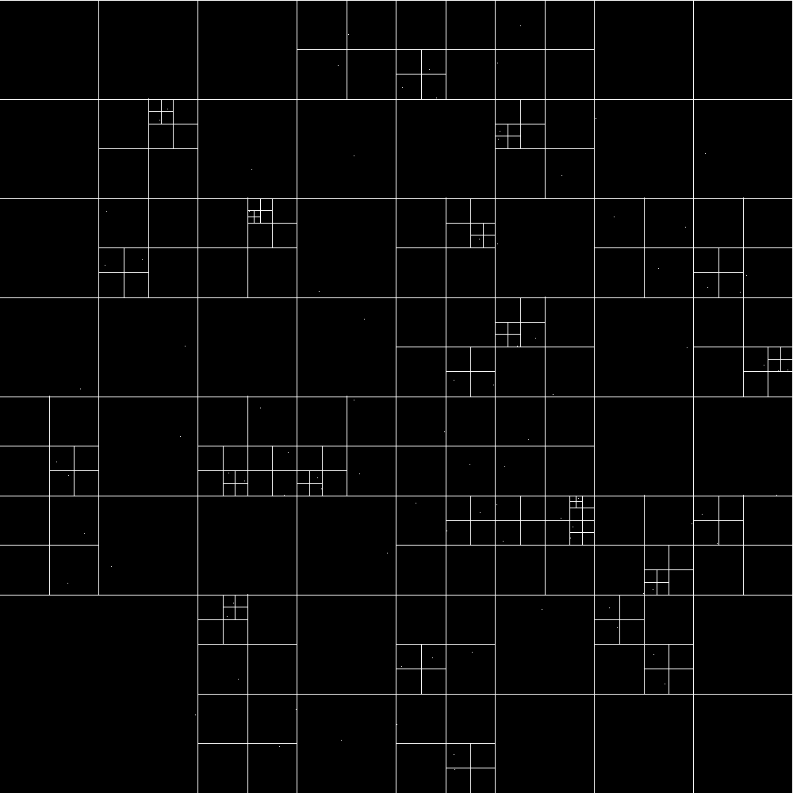

Requires PyOpenGL and numpy.

Run with: python3 Display.py

Click to insert a particle.

To toggle quadtree rendering, press 'q'

To play/pause the simulation, press 'p'

While the simulation is paused, to simulate a single timestep, press 's'

